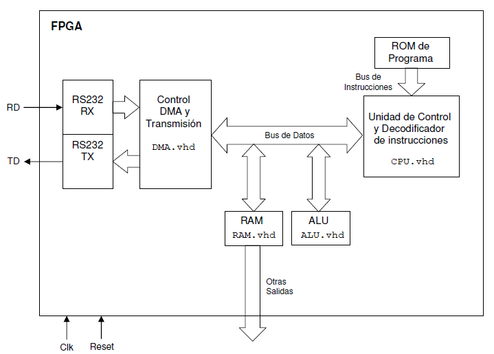

# Microcontroller
This project consists of the implementation of a microcontroller for an specific application in VHDL. The microcontroller has a very simplified architecture and a reduced set of instructions, so that using a simple machine code program it is possible to control some elements (switches, level actuators, thermostat, etc.).

For the project it is used the [Nexys 4 DDR development board](https://reference.digilentinc.com/reference/programmable-logic/nexys-4-ddr/reference-manual) of Digilent®.

The purpose of the system is to decode external commands that arrives through RS232 serial port at 115.200 bps and to behave consequently. The peripherics controlled by the uC are:
* 8 switches ON/OFF
* 10 LEDs (simulating actuators)
* A thermostat

## System Architecture
The internal architecture of the processor is Harvard type, it has one memory for data (RAM memory) and another one for the program (ROM memory) with separated databuses. Data is managed with a DMA controller to store it in the RAM memory. There are some special registers which are shared between the CPU and the DMA, and the operations are done with the ALU.

